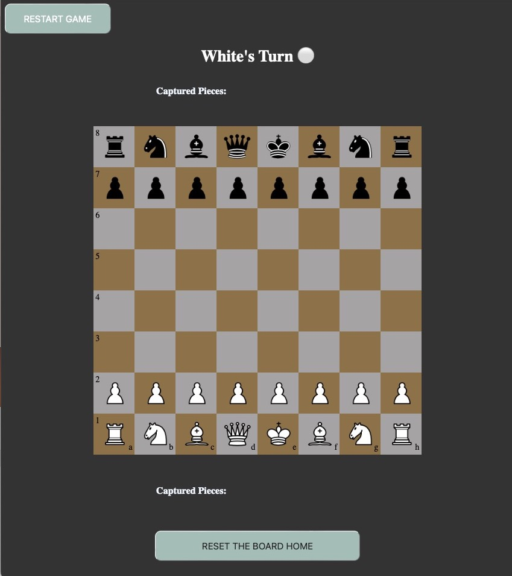

# Chess App Project

## Overview
The chess application caters to a variety of players by offering a comprehensive chess experience that includes both educational and competitive elements. The interface is designed for ease of use, enforcing chess rules and allowing for both single-player and multiplayer engagements.

***
## Setup
**Setup**
1. Open Terminal
2. Make Chess app directory
3. cd into directory
4. create / start virtual environment (mac)
	* python -m venv myenv
	* source myenv/bin/activate
5. clone GitHub Repo
	* git clone https://github.com/Real-UM-EECE-4081/chess_app
6. cd chess_app
7. install libraries
	* pip install -r requirements.txt

**Run it**
`python3 manage.py runserver`

